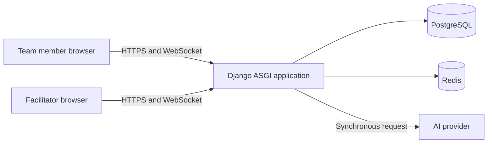
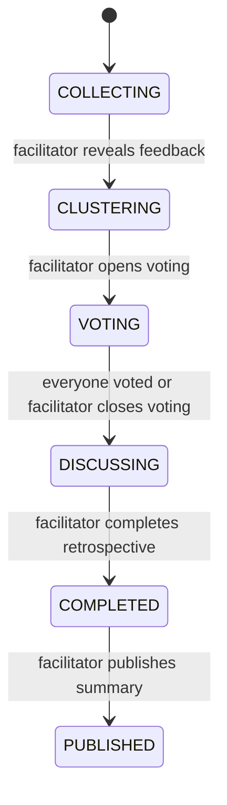
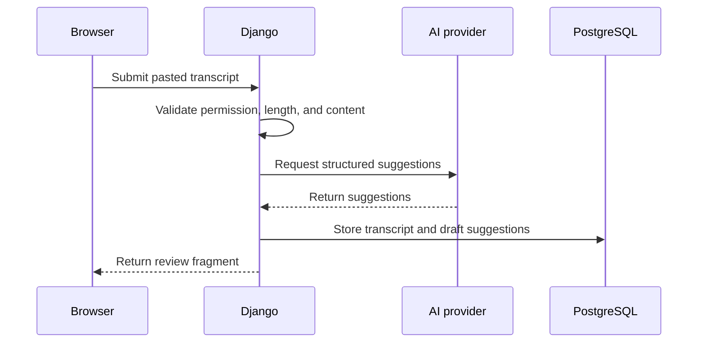
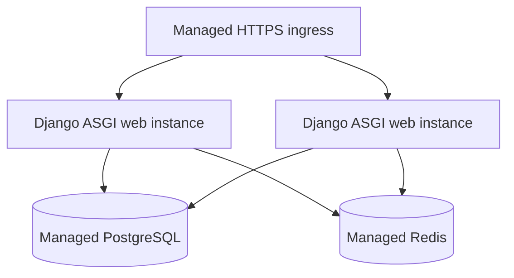

# Weekly Team Feedback Tool — Concrete Architecture

## 1. Purpose

This document defines the implementation architecture for the MVP described in
[`plan.md`](./plan.md). The selected application stack is Django with HTMX.

The architecture is designed around four product constraints:

1. Feedback remains private until the facilitator reveals it.
2. Anonymous feedback cannot be traced to its author through the application after reveal.
3. Board changes and stage transitions reach all meeting participants quickly.
4. AI suggestions come only from facilitator-pasted text and require facilitator approval.

## 2. Selected stack

| Concern | Technology | Responsibility |
| --- | --- | --- |
| Web application | Django | Routing, domain logic, permissions, forms, templates, and admin operations |
| Dynamic UI | HTMX | Form submission, partial page replacement, polling, and lightweight commands |
| Styling | Tailwind CSS | Responsive layout and reusable visual design |
| Drag and drop | SortableJS | Moving cards between clusters and reordering clusters |
| Realtime delivery | Django Channels | WebSocket connections and board event notifications |
| Primary database | PostgreSQL | Durable relational data, transactions, constraints, and row locking |
| Channel layer | Redis | Channels fan-out between web instances |
| AI integration | Provider-neutral Django services | Synchronous clustering and extraction requests |
| Application server | ASGI server | Serves Django HTTP and WebSocket traffic |
| Deployment | Container | A single Django web process type |

Exact package versions should be pinned when implementation begins. PostgreSQL and Redis should be managed services in production when possible.

## 3. System context



The browser receives complete pages for normal navigation and HTML fragments for HTMX requests. PostgreSQL remains the source of truth. WebSocket messages tell clients that something changed; clients then request an authorized HTML fragment from Django. Business records are not sent directly through the socket.

## 4. Application boundaries

Use a Django project with a small set of domain-focused applications.

### `accounts`

- Django user model and sign-in flows
- User profile data
- Authentication events

Start with a custom user model even if it initially adds only display name and email. Changing the user model later is unnecessarily disruptive.

### `projects`

- Projects
- Project membership
- Member and facilitator roles
- Project dashboard
- Open action items across retrospectives

### `retrospectives`

- Feedback cycles and stage transitions
- Feedback cards and anonymous edit ownership
- Clusters and card placement
- Voting
- Discussion topics and notes
- Decisions, action items, and published summaries
- Board HTTP views, HTMX fragments, and WebSocket consumers

This is the central domain application. Workflow rules belong in explicit service functions rather than views, model signals, or templates.

### `outcomes`

- Pasted transcript text
- AI-generated draft suggestions
- Facilitator review and confirmation
- Provider adapters for structured extraction

External provider code stays behind interfaces so providers can be changed without rewriting the retrospective domain.

## 5. Request and update model

### Standard navigation

Django renders full HTML pages for project pages, feedback forms, summaries, and initial board loads. Standard Django forms handle validation and CSRF protection.

### HTMX interactions

HTMX handles focused updates such as:

- Adding, editing, and deleting a feedback card
- Advancing the retrospective stage
- Renaming or merging a cluster
- Casting or removing votes
- Updating discussion status and notes
- Reviewing and confirming AI suggestions

Each mutation returns the smallest meaningful HTML fragment. Domain services perform the mutation before the view renders the response.

### Drag and drop

SortableJS manages pointer interaction in the browser. After a drop, it sends the card identifier, target cluster identifier, and intended position to a Django endpoint. Django validates the current stage and membership, updates the placement in a transaction, and returns the canonical cluster fragments.

The browser treats the optimistic move as provisional. If the server rejects the move or another participant changed the board first, the affected clusters are replaced with the server-rendered result.

### Realtime events

Each retrospective has a private Channels group such as `retro.<public_uuid>`. Only authenticated project members may join it.

Messages contain an event type and resource identifier, for example:

```text
board.changed
stage.changed
voting.closed
discussion.changed
summary.published
```

After receiving an event, the browser triggers an HTMX request for the relevant fragment. This approach keeps authorization and HTML rendering in ordinary Django views and makes reconnect recovery straightforward.

The system must never broadcast hidden feedback content, anonymous ownership data, individual votes, or unpublished AI suggestions.

## 6. Workflow state model

The main retrospective workflow uses an explicit state machine.



Only the facilitator can perform stage transitions. Every transition:

1. Locks the feedback-cycle row.
2. Confirms the current stage and facilitator permission.
3. Performs required finalization work in the same database transaction.
4. Commits the new stage.
5. Broadcasts a stage event after the transaction commits.

Pasting and analyzing a transcript is optional and independent of the workflow stage. A failed AI request does not move the retrospective backward or prevent manual notes, decisions, actions, completion, or publication.

## 7. Data model

All internal tables use numeric primary keys. Records exposed in URLs additionally use random public UUIDs so sequential identifiers are not revealed.

### Identity and projects

#### `User`

- `id`
- `public_id`
- `email`
- `display_name`
- Django authentication fields

#### `Project`

- `id`
- `public_id`
- `name`
- `created_by`
- timestamps

#### `ProjectMembership`

- `project_id`
- `user_id`
- `role`: `MEMBER` or `FACILITATOR`
- `is_active`
- timestamps

There is one active membership per user and project. A project may have multiple facilitators, while each feedback cycle records the facilitator currently responsible for it.

### Feedback and clustering

#### `FeedbackCycle`

- `id`
- `public_id`
- `project_id`
- `facilitator_membership_id`
- `title`
- `stage`
- `opened_at`
- `revealed_at`
- `voting_opened_at`
- `voting_closed_at`
- `completed_at`
- `published_at`
- timestamps

Only one non-completed cycle may exist for a project in the MVP.

#### `CycleParticipant`

- `cycle_id`
- `membership_id`
- `invited_at`
- `has_submitted`
- `attended_at`, nullable
- timestamps

This is the cycle's participant snapshot, so later project-membership changes do not rewrite retrospective history. `has_submitted` supports aggregate progress and success metrics but is not linked to particular cards. Before reveal, the normal facilitator view shows an aggregate submission count rather than identifying who submitted, which reduces the chance of inferring an anonymous author in a small team.

#### `FeedbackCard`

- `id`
- `public_id`
- `cycle_id`
- `category`: `START`, `STOP`, or `CONTINUE`
- `body`
- `is_anonymous`
- `attributed_author_id`, nullable
- `cluster_id`, nullable
- `position`
- timestamps

For attributed feedback, `attributed_author_id` identifies the contributor. For anonymous feedback, it is always null.

#### `AnonymousCardEditGrant`

- `card_id`
- `user_id`
- `created_at`

This table exists only while a cycle is collecting feedback. It allows the contributor to find and edit their anonymous cards without placing the author on the card itself. Application endpoints, Django admin, exports, and WebSocket events never expose this table to facilitators.

When feedback is revealed, all anonymous edit grants for the cycle are deleted in the same transaction as the stage transition. From that point, the application has no author-to-card link for anonymous cards.

Operational logs must not record request bodies or pair user identifiers with card identifiers. Database backups can retain deleted edit grants until their normal retention window expires; the privacy notice must state that operational limitation accurately.

#### `Cluster`

- `id`
- `public_id`
- `cycle_id`
- `name`
- `position`
- `origin`: `MANUAL` or `AI_SUGGESTED`
- timestamps

An AI clustering task may create suggested clusters and placements, but they are ordinary editable records once shown. Team members can rename, split, merge, move, or remove them.

### Voting and discussion

#### `VoteBudget`

- `cycle_id`
- `membership_id`
- `used_count`
- timestamps

One row is created for every active participant when voting opens. `used_count` is constrained to the range zero through three.

#### `VoteAllocation`

- `cycle_id`
- `membership_id`
- `cluster_id`
- `count`
- timestamps

There is one allocation per participant and cluster, with `count` from one through three. Casting or removing a vote locks the participant's `VoteBudget` row, adjusts the allocation, and updates `used_count` in one transaction.

Before voting closes, normal responses expose only the current participant's allocations and remaining budget. They do not compute or render cluster totals. When voting closes, totals are calculated and stored on discussion topics.

#### `DiscussionTopic`

- `id`
- `public_id`
- `cycle_id`
- `cluster_id`
- `title_snapshot`
- `rank`
- `vote_total`
- `status`: `PENDING`, `DISCUSSED`, `SKIPPED`, or `DEFERRED`
- `notes`
- timestamps

Creating discussion topics when voting closes provides a stable title and agenda even if cluster names are edited afterward.

#### `Decision`

- `id`
- `public_id`
- `cycle_id`
- `topic_id`, nullable
- `description`
- `source`: `MANUAL` or `AI_CONFIRMED`
- timestamps

#### `ActionItem`

- `id`
- `public_id`
- `cycle_id`
- `topic_id`, nullable
- `description`
- `owner_membership_id`
- `due_date`, nullable
- `status`: `OPEN` or `DONE`
- `source`: `MANUAL` or `AI_CONFIRMED`
- timestamps

Only the facilitator may create or materially edit an action during the retrospective. An assigned member may later change its status between open and done.

### Pasted transcripts and AI drafts

#### `TranscriptSubmission`

- `id`
- `public_id`
- `cycle_id`
- `text`
- `submitted_by`
- timestamps

Transcript text is stored in PostgreSQL. The MVP accepts pasted text only; it has no file upload, media storage, transcription, or processing-job model.

#### `DraftSuggestion`

- `id`
- `transcript_submission_id`, nullable for clustering suggestions
- `cycle_id`
- `topic_id`, nullable
- `kind`: `DECISION`, `ACTION`, or `SUMMARY`
- `content`
- `suggested_owner_membership_id`, nullable
- `suggested_due_date`, nullable
- `status`: `PENDING`, `CONFIRMED`, or `DISMISSED`
- `reviewed_by`, nullable
- `reviewed_at`, nullable
- timestamps

Confirming a suggestion creates or updates the corresponding durable domain record in a transaction. Draft suggestions never appear in a published summary.

#### `RetrospectiveSummary`

- `id`
- `public_id`
- `cycle_id`, unique
- `summary_text`
- `published_by`
- `published_at`
- timestamps

The summary page combines this reviewed narrative with the cycle's ranked topics, confirmed decisions, action items, attendance, aggregate participation, and original cards. Publication freezes the narrative and discussion record; action owners may still update action status afterward.

## 8. Authorization rules

Authorization is enforced in Django views and domain services. Hiding a control in a template is never considered authorization.

| Operation | Member | Facilitator |
| --- | --- | --- |
| View a project | Active membership required | Active membership required |
| Submit feedback | Own submission during `COLLECTING` | Same |
| Edit feedback | Own submission during `COLLECTING` | Same; cannot edit another member's card |
| View other feedback | From `CLUSTERING` onward | From `CLUSTERING` onward |
| Change stage | No | Cycle facilitator only |
| Edit clusters | During `CLUSTERING` | During `CLUSTERING` |
| Vote | Own votes during `VOTING` | Same |
| View totals | After voting closes | After voting closes |
| Edit discussion records | No | During `DISCUSSING` |
| Update action status | Assigned actions only | Any action in the project |
| Paste transcript text | No | Cycle facilitator only |
| Review AI drafts | No | Cycle facilitator only |
| Publish summary | No | Cycle facilitator only |

Every object lookup is scoped through the requesting user's active project membership. Knowing a public UUID is insufficient to access an object.

## 9. Critical transaction boundaries

The following operations must be atomic:

### Reveal feedback

- Lock the cycle.
- Verify it is in `COLLECTING`.
- Delete anonymous edit grants for the cycle.
- Set `revealed_at` and change the stage to `CLUSTERING`.
- Commit before broadcasting `stage.changed`.

### Move a card

- Verify the cycle is in `CLUSTERING`.
- Lock the affected card and target cluster.
- Update cluster and position.
- Normalize positions if necessary.
- Commit before broadcasting `board.changed`.

### Cast a vote

- Verify the cycle is in `VOTING`.
- Lock the participant's vote budget.
- Verify the resulting total is between zero and three.
- Update the allocation and budget together.
- Return only that participant's vote state.

### Close voting

- Lock the cycle.
- Aggregate vote totals.
- Create ranked discussion-topic snapshots.
- Change the stage to `DISCUSSING`.
- Commit before broadcasting `voting.closed`.

### Confirm an AI suggestion

- Lock the suggestion.
- Verify it is still pending and the reviewer is the facilitator.
- Create the decision or action item.
- Mark the suggestion confirmed.
- Commit before updating the review interface.

## 10. Synchronous AI requests

The MVP makes AI requests directly from Django when a facilitator asks for clustering or submits pasted transcript text for extraction.



The request uses a strict timeout and returns a retryable error without saving partial suggestions when the provider fails. A client-generated idempotency key prevents a repeated form submission from creating duplicate transcripts or suggestions.

This design intentionally has no task queue, worker, upload pipeline, or media processing.

## 11. AI boundaries

The domain layer calls provider-neutral interfaces:

- `ClusteringService.suggest(cards)`
- `ExtractionService.extract(transcript, topics)`

Provider responses are validated against explicit schemas before being stored. Suggested owners are matched only to active project memberships. An unmatched or ambiguous owner remains empty for facilitator review.

AI output is always treated as untrusted draft data:

- It cannot change workflow stages.
- It cannot publish a summary.
- It cannot create a confirmed decision or action directly.
- It cannot reveal anonymous authors.
- It is escaped when rendered and subject to the same length limits as manual content.

## 12. Template and URL structure

Use normal resource URLs for full pages and a clearly separated fragment namespace for HTMX responses.

```text
/projects/<project_uuid>/
/projects/<project_uuid>/cycles/<cycle_uuid>/feedback/
/projects/<project_uuid>/cycles/<cycle_uuid>/board/
/projects/<project_uuid>/cycles/<cycle_uuid>/transcript/
/projects/<project_uuid>/cycles/<cycle_uuid>/summary/

/fragments/cycles/<cycle_uuid>/feedback-cards/
/fragments/cycles/<cycle_uuid>/board/
/fragments/cycles/<cycle_uuid>/cluster/<cluster_uuid>/
/fragments/cycles/<cycle_uuid>/vote-panel/
/fragments/cycles/<cycle_uuid>/discussion-topic/<topic_uuid>/
/fragments/cycles/<cycle_uuid>/suggestion-review/
```

Mutation URLs should use POST or DELETE semantics and return a rendered fragment, a redirect header, or an empty success response with an HTMX trigger. They must reject requests made in the wrong workflow stage even when the user otherwise has the correct role.

Templates should be organized as pages, components, and fragments. The same component template should render both the initial page and later HTMX replacements so the two paths cannot drift.

## 13. Client-side behavior

Keep browser state minimal. The server owns workflow stage, card placement, vote budgets, discussion status, and AI draft state.

Small JavaScript modules are appropriate for:

- Initializing SortableJS after HTMX swaps
- Opening and reconnecting the retrospective WebSocket
- Translating socket events into HTMX refresh requests
- Focus management and accessible announcements after fragment swaps

Do not introduce a client-side application store for the MVP. JavaScript modules must be safe to initialize more than once because HTMX can replace their containing elements.

## 14. Security and privacy

- Require HTTPS in production and secure, HTTP-only session cookies.
- Use Django CSRF protection for every state-changing HTTP request, including HTMX requests.
- Apply rate limits to sign-in, invitations, feedback submission, and AI requests.
- Enforce a transcript text length limit before calling the AI provider.
- Escape all feedback, transcript, note, and AI-generated content in templates.
- Keep provider credentials in the runtime secret store.
- Do not place card bodies, transcript text, anonymous edit grants, or individual votes in application logs.
- Record facilitator actions such as reveal, close voting, confirm suggestion, and publish in a domain audit log.
- Exclude anonymous ownership records from generic administration and data exports.
- Define retention periods for transcripts, provider payloads, logs, and backups before production use.

The audit log records that a feedback card was created or changed without recording the anonymous author's identity and card identifier together.

## 15. Deployment topology

Use one application image and one web process type.



Required process types:

- `web`: Django under an ASGI server, serving HTTP and WebSockets
- `migrate`: one-off Django migration command during deployment
- `assets`: build-time Tailwind and static-file compilation

The first production deployment can use one web instance. Redis exists only for Channels fan-out and can be added when live updates must work across multiple web instances. Local development can use the in-memory channel layer.

## 16. Observability and operations

Use structured logs with a request ID, cycle public ID, job ID, event name, duration, and result. Avoid user-authored text and private identifiers.

Capture at least these metrics:

- HTTP request latency and error rate
- Active WebSocket connections and reconnect rate
- AI request duration, timeout rate, and failures
- Time from transcript submission to suggestions ready for review
- Provider latency, error rate, and usage
- Retrospective stage-transition failures

Report unexpected exceptions to an error-tracking service. Health checks should separately cover the web process, database connection, and Redis connection.

## 17. Testing strategy

### Domain tests

Prioritize state and permission boundaries:

- Members cannot read other submissions during collection.
- A facilitator cannot read the anonymous edit-grant table through application interfaces.
- Reveal deletes anonymous edit grants and exposes all cards atomically.
- Stage transitions reject invalid previous states.
- Concurrent vote requests cannot exceed three votes.
- Vote totals remain hidden until voting closes.
- Only assigned members can update their action status.
- AI suggestions cannot enter summaries before confirmation.

### Integration tests

- HTMX mutations return the correct fragments and triggers.
- WebSocket group membership requires an active project membership.
- Socket events cause authorized fragment refreshes.
- Repeated transcript submissions with the same idempotency key do not duplicate suggestions.
- Provider timeouts do not save partial suggestions.

### Browser tests

Keep a small end-to-end suite around the complete MVP path: submit feedback, reveal, cluster, vote, discuss, review extracted outcomes, and publish. Include two browser sessions for privacy and live-update behavior.

## 18. Suggested implementation order

1. Establish the Django project, custom user model, PostgreSQL, authentication, projects, and memberships.
2. Implement feedback cycles, private card submission, anonymous edit grants, and the reveal transaction.
3. Build the HTMX board and SortableJS clustering interactions.
4. Add voting with transactional budgets and hidden totals.
5. Add discussion topics, notes, decisions, action items, and summary publication.
6. Add Channels events and live fragment refreshes to the already-working HTTP flows.
7. Add pasted transcript storage and synchronous AI extraction behind provider-neutral interfaces.
8. Complete privacy hardening, audit events, retention cleanup, observability, and end-to-end tests.

Building the HTTP workflow before realtime delivery keeps every operation usable and testable even when a socket disconnects.

## 19. Deferred architecture

The MVP architecture deliberately omits:

- A public REST or GraphQL API
- A single-page application framework
- Event sourcing
- Microservices
- Kubernetes
- A vector database
- Cross-project analytics infrastructure
- Meeting-platform integrations
- Notification infrastructure

These can be added when a confirmed product requirement demands them. None is necessary to complete the workflow in `plan.md`.
